# Rick & Morty

Flutter-приложение по вселенной «Рик и Морти»: персонажи, локации и эпизоды с
поиском и фильтрацией. Построено на **Clean Architecture** с разделением на
`data` / `domain` / `presentation` по фичам.

API: <https://rickandmortyapi.com/api> (только GET-запросы, ответы в JSON).

## Скриншоты

| Персонажи (список) | Фильтры | Карточка персонажа |
|:---:|:---:|:---:|
| 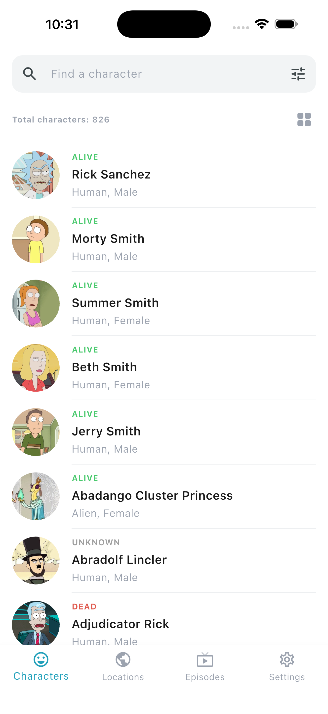 | 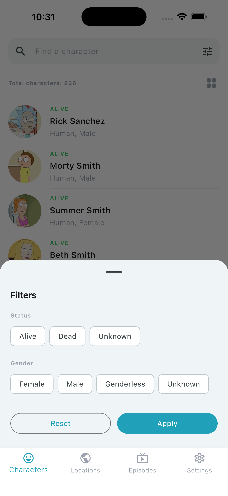 | 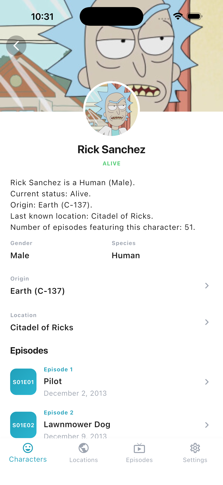 |

| Локации (обложки-коллажи) | Локация (деталь) | Эпизоды (обложки-коллажи) |
|:---:|:---:|:---:|
| 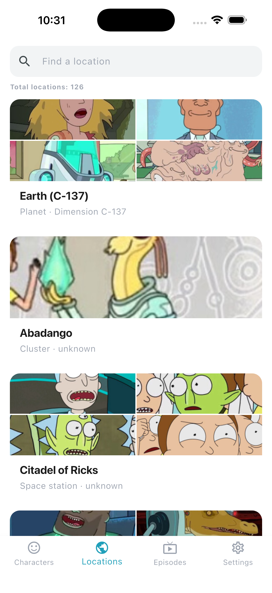 | 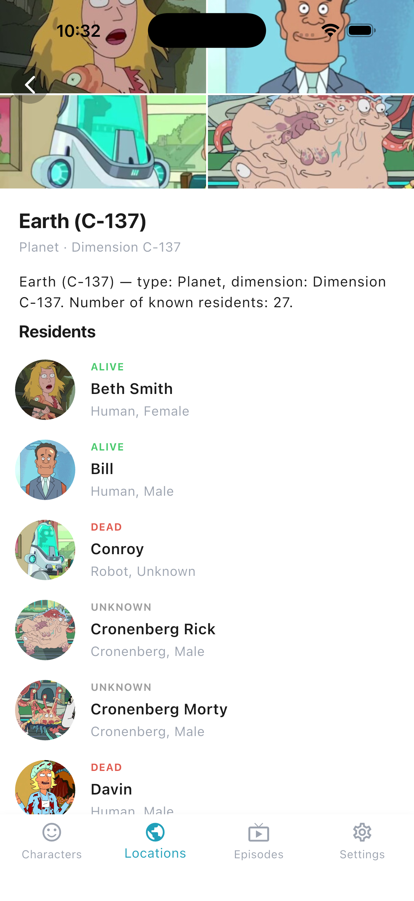 | 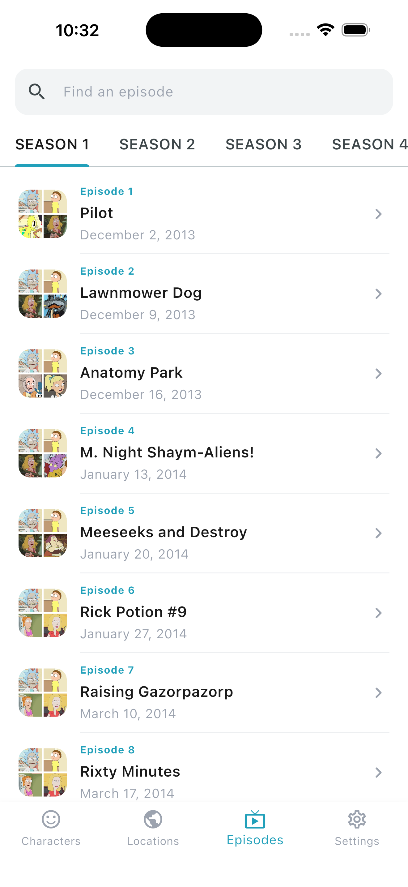 |

| Эпизод (деталь) | Настройки + переключатель языка | Редактирование профиля |
|:---:|:---:|:---:|
| 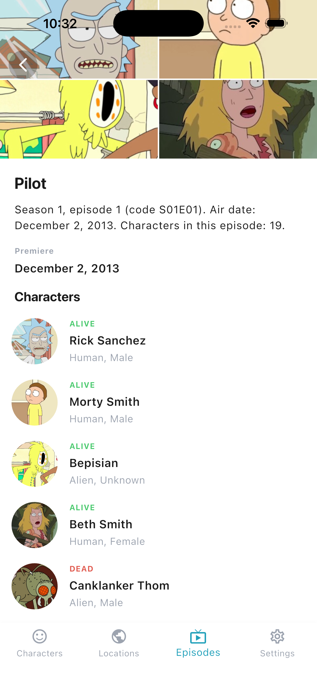 | 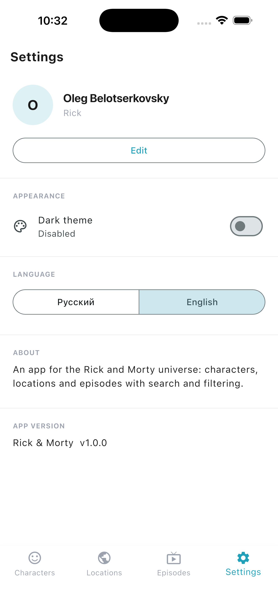 | 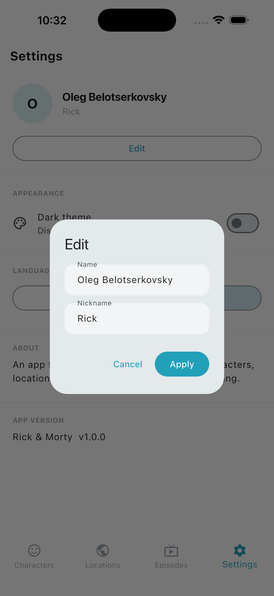 |

| Тёмная тема + русский | Сетка персонажей |  |
|:---:|:---:|:---:|
| 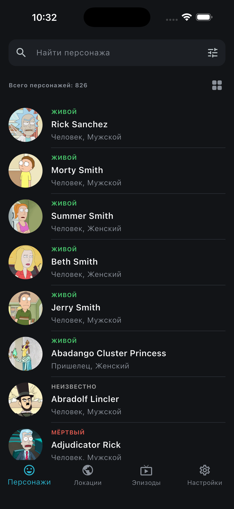 | 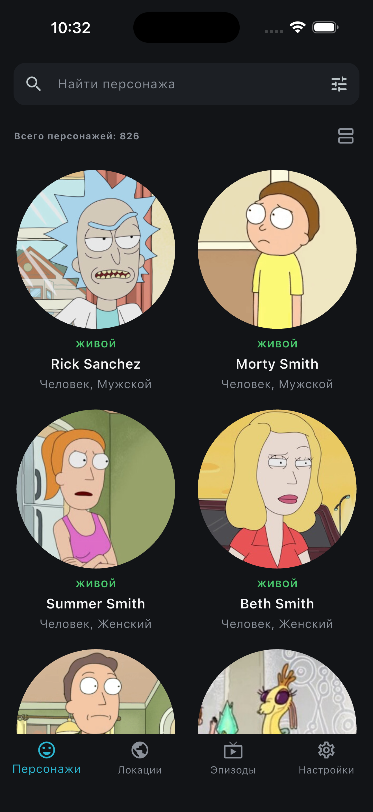 |  |

## Стек

| Слой | Пакеты |
|------|--------|
| Навигация | `go_router`, `go_router_builder` (типизированные маршруты) |
| State | `flutter_bloc` (фичи), `provider` (тема, локаль, профиль) |
| DI | `get_it`, `injectable` |
| Сеть | `dio`, `retrofit`, `internet_connection_checker_plus`, `pretty_dio_logger` |
| Локализация | `intl` + `flutter_localizations` (RU / EN, ARB) |
| Функциональщина | `fpdart` (Either), `equatable` |
| UI | `cached_network_image`, `shimmer` |
| Хранилище | `shared_preferences` |

## Архитектура

```
lib/
├── core/                     # переиспользуемая инфраструктура
│   ├── bloc/                 # event-трансформеры (debounce/throttle)
│   ├── constants/            # эндпоинты API, ключи prefs
│   ├── di/                   # инициализация get_it/injectable
│   ├── error/                # Exceptions (data) → Failures (domain)
│   ├── network/              # Dio, retrofit-интерсепторы, NetworkInfo
│   ├── router/               # go_router + типизированные маршруты
│   ├── theme/                # светлая/тёмная темы, контроллер настроек
│   ├── usecase/              # базовый UseCase, Paginated<T>
│   ├── utils/                # extensions, парсер id из url
│   └── widgets/              # общие виджеты (поиск, ошибки, секции…)
└── features/
    ├── characters/           # список (список/сетка), поиск, фильтр, деталь
    ├── locations/            # список, деталь с резидентами
    ├── episodes/             # вкладки по сезонам, деталь с персонажами
    └── settings/             # профиль, переключатели тёмной темы и языка
        ├── data/
        ├── domain/ (entities, repositories, usecases)
        └── presentation/ (bloc, pages, widgets)
```

Поток данных: `Page → Bloc/Cubit → UseCase → Repository (domain)` →
`RepositoryImpl → RemoteDataSource → retrofit ApiService → Dio (data)`.
Ошибки превращаются в `Failure` и возвращаются через `Either<Failure, T>`.

### State-менеджмент
- **BLoC** — списки и детали (поиск с debounce, пагинация с throttle, фильтры).
- **Cubit** — экраны деталей и список эпизодов.
- **provider** — глобальные настройки (`AppSettingsController` — тема/локаль) и
  локальный профиль (`ProfileController`).

## Генерация кода

В проекте используется кодогенерация (`injectable`, `retrofit`, `freezed`,
`json_serializable`, `go_router_builder`, `gen-l10n`). Сгенерированные файлы
(`*.g.dart`, `*.freezed.dart`, `*.config.dart`, `app_localizations.dart`)
закоммичены, но при изменении аннотированного кода их нужно перегенерировать:

```bash
flutter pub get
dart run build_runner build --delete-conflicting-outputs
```

`flutter gen-l10n` запускается автоматически при сборке (`generate: true` в
`pubspec.yaml`), либо вручную:

```bash
flutter gen-l10n
```

## Запуск

```bash
flutter pub get
dart run build_runner build --delete-conflicting-outputs
flutter run
```

## Тесты

```bash
flutter test
```

## Что было сделано

- **Фичи персонажей, локаций и эпизодов** на Clean Architecture: списки с
  поиском и пагинацией, фильтры, детальные экраны со связанными сущностями.
- **Обложки-коллажи для локаций и эпизодов.** У этих сущностей в API нет
  изображения (см. «Замечания по данным»), поэтому обложку собираем из реальных
  аватаров связанных персонажей — мозаика 1–4 портретов (виджет
  `AvatarCollage`). Применяется и в списках, и на детальных экранах — раньше там
  были декоративные градиентные плейсхолдеры.
  - Аватары догружаются **батч-запросом** `/character/id1,id2,…` (один запрос на
    страницу/набор) с дедупликацией id и кэшированием в state — без N+1.
  - Пока портреты грузятся (или у сущности нет персонажей) — graceful-fallback
    на декоративный градиент, без «дёргания» UI.
- **Переключатель языка** (RU / EN) на экране настроек — `SegmentedButton`,
  мгновенно меняет локаль без перезапуска; выбор хранится в `shared_preferences`.
- **Локализация RU/EN** с глоссарием (`RuGlossary`): значения из API (раса,
  типы/измерения и названия локаций, названия эпизодов) переводятся на русский,
  незнакомые значения остаются как есть.
- Светлая/тёмная темы, локальный профиль в настройках.

## Замечания по данным

Открытый Rick and Morty API возвращает изображения **только для персонажей**.
У **локаций и эпизодов поля с картинкой нет** — есть лишь текстовые поля и
списки связанных персонажей (`residents` у локации, `characters` у эпизода).

Чтобы не выдумывать контент и при этом не оставлять пустые баннеры, обложки
локаций и эпизодов собираются из **реальных аватаров связанных персонажей**
(коллаж 2×2 — виджет `AvatarCollage`). Если персонажей нет или они ещё не
загрузились — показывается нейтральный декоративный градиент.

Текстовые «сводки» на детальных экранах (`characterSummary`, `episodeSummary`,
`locationSummary`) формируются из **реальных полей API** (статус, раса, место
рождения, дата выхода, число персонажей и т.д.), а не из заглушек.

Профиль на экране настроек — локальный, хранится в `shared_preferences`.
